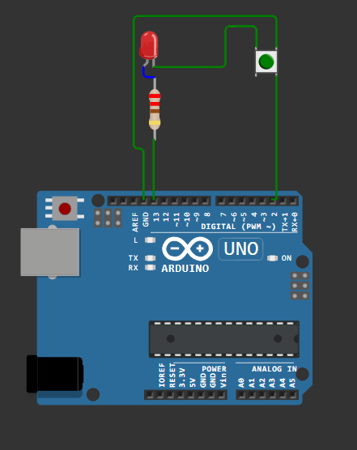

# my-starter-project
My first simple aurdino uno project on Wokwi where i connect LED, and push-button.

## 🤖 Features
- Let LED blink when button is turned ON and OFF.

## 🔧 Tech Stack
- Arduino UNO
- 220Ω Resistor
- LED
- Push-button 6mm

## 🔌 Hardware Setup
- Wokwi.com
- 

## 👩‍💻 Firmware Code
see code in firmware/src/main.cpp
